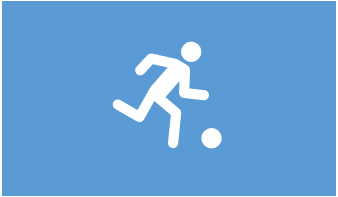

<!doctype html>
<html lang="en">
    <head>

        <meta charset="utf-8">
        <meta name="viewport" content="width=device-width, initial-scale=1">

        <link href="https://cdn.jsdelivr.net/npm/bootstrap@5.0.1/dist/css/bootstrap.min.css" rel="stylesheet" integrity="sha384-+0n0xVW2eSR5OomGNYDnhzAbDsOXxcvSN1TPprVMTNDbiYZCxYbOOl7+AMvyTG2x" crossorigin="anonymous">
        <link rel="stylesheet" href="css/estilo-inicio.css">
        <title>Colegio del Valle</title>
    </head>
    <body>
        

            <header>
                <h1 id="titulo" class="text-center">COLEGIO DEL VALLE</h1>
            </header>
            <nav id="navegador" class="navbar navbar-expand-lg navbar-light  text-center">
                

                    <a class="nav-link active" aria-current="page" style="width: 15rem;" href="#headingOne"><strong>Quienes Somos</strong></a>
                    <button class="navbar-toggler" type="button" data-bs-toggle="collapse" data-bs-target="#navbarSupportedContent" aria-controls="navbarSupportedContent" aria-expanded="false" aria-label="Toggle navigation">
                        
                    </button>
                    

                        <ul class="navbar-nav me-auto mb-2 mb-lg-0" id="contenido">
                            <li class="nav-item" style="width: 10rem;">
                                <a class="nav-link" aria-current="page" href="registro-de-notas.html"><strong>Registro de Notas</strong></a>
                            </li>
                            <li class="nav-item" style="width: 14rem;">
                                <a class="nav-link" href="muro_escolar.html"><strong>Muro Escolar</strong></a>
                            </li>
                            <li class="nav-item" style="width: 13rem;">
                                <a class="nav-link" href="calculadora.html"><strong>Calculadora Escolar</strong></a>
                            </li>
                            <li class="nav-item" style="width: 14rem;">
                                <a class="nav-link" href="contacto.html"><strong>Contacto Escolar</strong></a>
                            </li>
                        </ul>
                    

                

            </nav>
            <article>
                

                    

                        

                            
                        

                        

                            
                        

                        

                            
                        

                    

                    <button class="carousel-control-prev" type="button" data-bs-target="#carouselExampleControls" data-bs-slide="prev">
                        
                        Previous
                    </button>
                    <button class="carousel-control-next" type="button" data-bs-target="#carouselExampleControls" data-bs-slide="next">
                        
                        Next
                    </button>
                

                <section>
                    

                        

                            <h2 class="accordion-header" id="headingOne" >
                                <button class="accordion-button" type="button" data-bs-toggle="collapse" data-bs-target="#collapseOne" aria-expanded="true" aria-controls="collapseOne">
                                <strong>¿ Quienes Somos ?</strong>
                                </button>
                            </h2>
                            

                                

                                Somos una centro educativo, en el cual brindamos una <strong>educación de calidad</strong> para formar personas con liderazgo y alto sentido ético, capaces de enfrentar la vida dignamente.  Para ello contamos con un equipo de profesionales altamente calificados y de amplia experiencia que maximizan las competencias de los estudiantes para garantizar una formación integral con excelencia académica.
                                

                            

                        

                        

                            <h2 class="accordion-header" id="headingTwo">
                                <button class="accordion-button collapsed" type="button" data-bs-toggle="collapse" data-bs-target="#collapseTwo" aria-expanded="false" aria-controls="collapseTwo">
                                <strong>Objetivos</strong>
                                </button>
                            </h2>
                            

                                

                                    <ul>
                                        <li>Motivar e involucrar al estudiante en un nuevo sistema de aprendizaje de alta exigencia.</li>
                                        <li>Desarrollar sistemas de aprendizaje de acuerdo a la capacidad del estudiante.</li>
                                        <li>Fomentar el desarrollo de valores y la participación de la familia en la tarea educativa.</li>
                                        <li>Brindar herramientas adecuadas al estudiante para su ingreso y posterior formación profesional en la universidad o centro superior.</li>
                                    </ul>
                                

                            

                        

                    

                </section>
                <section class="container m-5" id='cards'>
                    

                        

                             
                            
                            

                                <h5 class="card-title"><strong>Matemática</strong></h5>
                                
Resuelve problemas de cantidad, forma, movimiento, equivalencia y de gestión de datos. Logra superar los ejercicios con diferentes niveles de complejidad.

                            

                        

                        

                             
                            
                            

                                <h5 class="card-title"><strong>Comunicación</strong></h5>
                                
Comprende y construye texto, con ello mejora su comunicación para interactuar con otras personas. Conoce la evolución del lenguaje y la interpreta; así mismo, aprende y aplica las normas ortográficas.

                            

                        

                        

                             
                            
                            

                                <h5 class="card-title"><strong>Historia</strong></h5>
                                
Conoce la historia de nuestro país desde tiempos remotos hasta la consolidación de la república, generando la construcción de su propia identidad y el desarrollo de su autonomía. Reconoce la diversidad geográfica y sus características.

                            

                        

                        

                             
                            
                            

                                <h5 class="card-title"><strong>Ciencias</strong></h5>
                                
Contribuye al cuidado de los ecosistemas desde su conocimiento y comprensión de la ciencia. Reconoce que la tecnología permite el desarrollo de la humanidad.

                            

                        

                    
  
                    

                        

                             
                            
                            

                                <h5 class="card-title"><strong>Educación Física</strong></h5>
                                
Desarrolla una conciencia crítica hacia el cuidado de su salud y la de los demás. Es autónomo y capaz de asumir sus propias decisiones para mejorar su calidad de vida.

                            

                        

                        

                             
                            
                            

                                <h5 class="card-title"><strong>Inglés</strong></h5>
                                
Comprende y produce textos orales y escritos en inglés. Esta es una lengua extranjera importante, ya que permite acceder a los últimos avances tecnológicos, así como estar conectado con el mundo.

                            

                        

                        

                             
                            
                            

                                <h5 class="card-title"><strong>Arte y Cultura</strong></h5>
                                
Fortalece su autoestima, la valoración y aceptación de los demás; consecuentemente, reconoce que el diálogo intercultural contribuye con la afirmación de las identidades personales y colectivas.

                            

                        

                        

                             
                            
                            

                                <h5 class="card-title"><strong>Valores</strong></h5>
                                
Este curso está a cargo del área de Psicología y, a través de él, se fortalecen los distintos valores que formamos en nuestros estudiantes.

                            

                        

                    

                </section>
            </article>
        

        
    </body>
</html>
